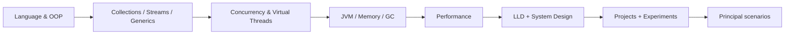

# Java 25 Mastery

**Principal Software Engineer track** — a personal knowledge base for mastering **JDK 25 (LTS)** at production depth: JVM, concurrency, performance, design, and interview judgment.

This is not a beginner tutorial. It is a reference book, laboratory, and interview portfolio aimed at **Principal-level** engineering interviews and real systems work.

| | |
|--|--|
| **Runtime** | Java / JDK **25** LTS |
| **Standard** | [MASTER_INSTRUCTION.md](./MASTER_INSTRUCTION.md) · [DEEP_LEARNING_STANDARD.md](./DEEP_LEARNING_STANDARD.md) |
| **Short path** | [interview-prep/senior-priorities.md](./interview-prep/senior-priorities.md) |
| **Incidents** | [scenario-lab](./scenario-lab/) |
| **PE evidence** | [principal-engineer/portfolio](./principal-engineer/portfolio/) · [refusals](./principal-engineer/refusals.md) · [experiments/EVIDENCE.md](./experiments/EVIDENCE.md) |
| **UI defaults** | Inter · eye-comfort colors · 16px body (Cursor rule) |

```bash
java -version    # expect 25.x
javac -version
```

---

## Career objective

Build the judgment to:

- design and evolve large Java systems  
- debug JVM, GC, concurrency, and latency incidents  
- reason in LLD and system-design interviews  
- choose trade-offs under constraints — not recite APIs  

---

## Engineering principles

Depth > breadth · Judgment > memorization · Production > toys · Trade-offs > dogma · Experiments > assumptions · Java 25 > outdated habits · Quality > quantity  

Prefer: **Concept → Internals → Code → Experiment → Trade-offs → Production → Interview**

---

## Learning roadmap



1. **Foundation** — language, OOP/SOLID, modern Java 8→25  
2. **Core depth** — collections, generics, streams, exceptions  
3. **Systems Java** — concurrency, virtual threads, JVM, GC, performance  
4. **Design** — patterns, LLD, system design, distributed concepts  
5. **Proof** — real-world projects, experiments, Principal scenarios  
6. **Interview** — [tracks + formats](./interview-prep/) (primary) + question bank + coding patterns; depth packs only to fill holes  

---

## Interview preparation strategy

| Layer | Role |
|-------|------|
| [interview-prep](./interview-prep/) | **How to answer** — tracks + formats; depth packs as backup |
| [scenario-lab](./scenario-lab/) | **Incidents** — investigate before spoilers (CPU, GC, deadlock, Kafka, VT, …) |
| [java-interview-questions](./java-interview-questions/) | **Breadth** — scenario Q&A bank |
| [coding-problems](./coding-problems/) | Pattern drills, not LeetCode dumps |
| [low-level-design](./low-level-design/) / [system-design](./system-design/) | Design interviews |
| [principal-engineer](./principal-engineer/) | Staff/Principal scenario reasoning |
| [cheat-sheets](./cheat-sheets/) | Final revision only — trust chapters |
| [real-world-projects](./real-world-projects/) | Demonstrable portfolio |

Prioritize ⭐⭐⭐⭐⭐ topics first: Collections, Concurrency, JVM, Streams, OOP/SOLID, Java evolution, Virtual Threads, Memory/GC, System Design, LLD.

---

## Repository structure

```text
java-25-mastery/
├── MASTER_INSTRUCTION.md     # binding content standard
├── .cursor/rules/            # Java 25 + Principal + UI comfort
├── interview-prep/           # dimensional senior prep
├── scenario-lab/             # incident investigations (no spoilers first)
├── java-interview-questions/ # breadth Q&A
├── coding-problems/          # pattern-organized problems
├── low-level-design/
├── system-design/
├── real-world-projects/      # compilable Java 25 demos
├── experiments/              # Hypothesis → Observation
├── cheat-sheets/             # high-signal summaries
├── principal-engineer/       # Principal-level scenarios
└── <topic chapters>/         # curriculum notes
```

Topic chapters use one `.md` per concept; many include `interview.md`. Practical CLIs live under `practical/` where present. Prefer improving existing files over duplicating them.

---

## Topic map

| Area | Folders |
|------|---------|
| Language | [java-fundamentals](./java-fundamentals/), [oop](./oop/), [modern-java](./modern-java/), [16-java-25-features](./16-java-25-features/) |
| APIs | [collections](./collections/), [generics](./generics/), [functional-programming](./functional-programming/), [stream-api](./stream-api/), [exception-handling](./exception-handling/), [io-nio](./io-nio/), [date-time](./date-time/) |
| Runtime | [concurrency](./concurrency/), [virtual-threads](./virtual-threads/), [reactive-programming](./reactive-programming/), [jvm-internals](./jvm-internals/), [memory-management](./memory-management/), [garbage-collection](./garbage-collection/), [performance-engineering](./performance-engineering/) |
| Design | [design-patterns](./design-patterns/), [modern-java-engineering](./modern-java-engineering/), [low-level-design](./low-level-design/), [system-design](./system-design/) |
| Platform | [jdbc](./jdbc/), [networking](./networking/), [security](./security/), [testing](./testing/), [build-tools](./build-tools/) |
| Interview & proof | [interview-prep](./interview-prep/), [scenario-lab](./scenario-lab/), [java-interview-questions](./java-interview-questions/), [coding-problems](./coding-problems/), [real-world-projects](./real-world-projects/), [principal-engineer](./principal-engineer/), [experiments](./experiments/), [cheat-sheets](./cheat-sheets/) |

---

## Projects

Compilable **Java 25** demos (`run.sh`, no Maven required):

| Project | Demonstrates |
|---------|----------------|
| [01-cli-application](./real-world-projects/01-cli-application/) | Production-feel CLI |
| [02-multithreaded-application](./real-world-projects/02-multithreaded-application/) | Executors, CF, CHM, locks, atomics, VT |
| [03-http-service](./real-world-projects/03-http-service/) | VT HTTP server/client, timeouts, retries, metrics |
| [04-event-processing](./real-world-projects/04-event-processing/) | Producer → queue → consumers → store |
| [05-performance-lab](./real-world-projects/05-performance-lab/) | Platform vs VT vs CF microbench |
| [06-url-shortener-service](./real-world-projects/06-url-shortener-service/) | Codes, cache, rate limit (LLD/SD bridge) |
| [07-payment-orchestrator](./real-world-projects/07-payment-orchestrator/) | Idempotency, PSP unknown outcomes |
| [08-notification-outbox](./real-world-projects/08-notification-outbox/) | Outbox vs dual-write |

```bash
chmod +x real-world-projects/*/run.sh
./real-world-projects/05-performance-lab/run.sh --tasks 1000 --delay-ms 5
```

---

## Experiments

Scientific loops live in [experiments](./experiments/): **Hypothesis → Setup → Code → Observation → Conclusion**. Prefer measurement over folklore (especially for VT, GC, and streams).

---

## Progress tracking

Use [senior-priorities](./interview-prep/senior-priorities.md) as the checklist. Practice tracks/formats first; use depth packs only after a failed mock exposes a hole. Log incidents end-to-end via [scenario-lab](./scenario-lab/) and [principal-engineer/scenarios](./principal-engineer/scenarios/).

---

## How to contribute to your own learning

1. Inspect what already exists before adding files.  
2. Deepen weak sections with internals, trade-offs, and Principal perspective.  
3. Add an experiment when a claim needs evidence.  
4. Cross-link chapters; do not fork duplicate notes.  
5. Ask: *Would this help in a Principal interview and in production?*  

---

## Chapters (detail)

| Folder | Topics |
|--------|--------|
| [java-fundamentals](./java-fundamentals/) | JDK/JRE/JVM, compilation, tools, classpath, modules, packages, access, types, operators, control flow, loops, arrays, methods, varargs, static, final, interview |
| [oop](./oop/) | Class through sealed/records, interview |
| [modern-java](./modern-java/) | var, patterns, records, sealed, modules, Java 8→25 interview |
| [collections](./collections/) | Lists/maps/sets + hashing internals |
| [generics](./generics/) | PECS, erasure, bounds |
| [functional-programming](./functional-programming/) | Lambdas, `java.util.function`, composition |
| [stream-api](./stream-api/) | Pipelines, collectors, parallel pitfalls |
| [exception-handling](./exception-handling/) | Checked/unchecked, TWR, suppressed |
| [io-nio](./io-nio/) | NIO.2 + practical CLIs |
| [date-time](./date-time/) | `java.time` |
| [concurrency](./concurrency/) | JMM, VarHandle, locks, executors, concurrent collections ⭐ |
| [virtual-threads](./virtual-threads/) | Loom, pinning, vs reactive ⭐⭐⭐ |
| [reactive-programming](./reactive-programming/) | Reactive Streams, backpressure, vs VT ⭐ |
| [jvm-internals](./jvm-internals/) | Loaders, JIT, memory areas ⭐⭐⭐ |
| [memory-management](./memory-management/) | Refs, dumps, leak analysis |
| [garbage-collection](./garbage-collection/) | G1/ZGC/Shenandoah ⭐⭐⭐ |
| [16-java-25-features](./16-java-25-features/) | Language/API/JVM + LTS evolution ⭐⭐⭐ |
| [performance-engineering](./performance-engineering/) | JFR, profiling, low-latency / high-throughput, JVM observability |
| [design-patterns](./design-patterns/) | GoF + Java idioms |
| [jdbc](./jdbc/) | Transactions, pooling, injection/N+1 |
| [networking](./networking/) | TCP/HTTP/HttpClient |
| [security](./security/) | Crypto, TLS, secrets |
| [testing](./testing/) | JUnit, Mockito, Testcontainers |
| [build-tools](./build-tools/) | Maven + Gradle |
| [modern-java-engineering](./modern-java-engineering/) | SOLID, API design, observability |
| [coding-problems](./coding-problems/) | Pattern-first coding ⭐⭐⭐ |
| [low-level-design](./low-level-design/) | LLD problems ⭐⭐⭐ |
| [system-design](./system-design/) | SD + distributed patterns ⭐⭐⭐ |
| [java-interview-questions](./java-interview-questions/) | Breadth Q&A bank |
| [real-world-projects](./real-world-projects/) | Portfolio demos ⭐⭐⭐ |
| [interview-prep](./interview-prep/) | Tracks + formats (primary); depth packs secondary |
| [scenario-lab](./scenario-lab/) | 15 production incident investigations (CPU, GC, deadlock, Kafka lag, VT misuse, …) |
| [principal-engineer](./principal-engineer/) | Principal scenarios (org + technical) |
| [experiments](./experiments/) | Measured labs |
| [cheat-sheets](./cheat-sheets/) | High-signal summaries |
