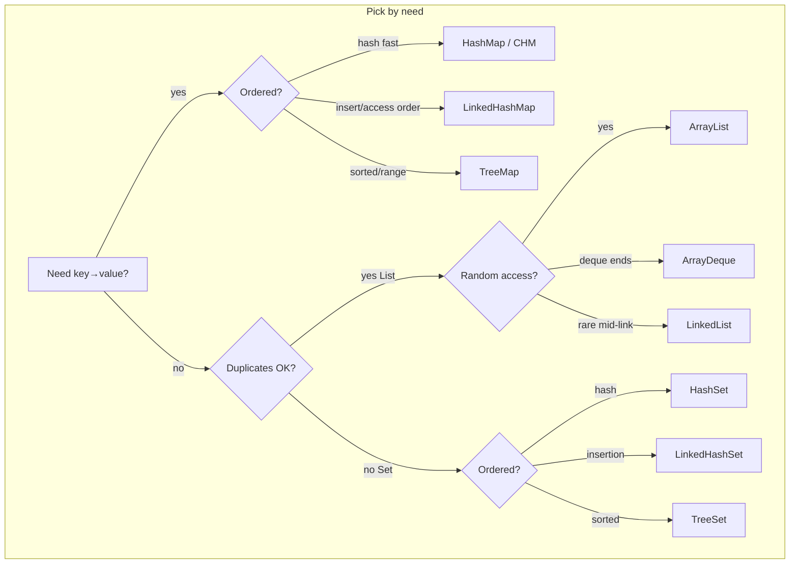

# Java Collections — Advanced Engineering Guide

Production-oriented collections for **Java 25**: internals, complexity, concurrency, decision matrices, and failure modes — not a beginner API tour.

**Standards:** [DEEP_LEARNING_STANDARD.md](../DEEP_LEARNING_STANDARD.md) · [MASTER_INSTRUCTION.md](../MASTER_INSTRUCTION.md)

## Hierarchy

```text
Iterable
└── Collection
    ├── List .......... ArrayList, LinkedList, CopyOnWriteArrayList, Vector†
    ├── Set ........... HashSet, LinkedHashSet, TreeSet
    └── Queue
        └── Deque ..... ArrayDeque, LinkedList
            PriorityQueue (Queue, not Deque)
            BlockingQueue* (concurrent)

Map (separate) ........ HashMap, LinkedHashMap, TreeMap, Hashtable†, ConcurrentHashMap*
```

† Legacy — prefer modern alternatives.  
\* `java.util.concurrent`.



## Study path

1. [collection.md](./collection.md) → [list](./list.md) / [set](./set.md) / [map](./map.md) / [queue](./queue.md) / [deque](./deque.md)  
2. Lists: [arraylist](./arraylist.md) → [linkedlist](./linkedlist.md) → [copyonwritearraylist](./copyonwritearraylist.md)  
3. Hashing spine: [hashing](./hashing.md) → [hash-buckets](./hash-buckets.md) → [hash-collisions](./hash-collisions.md) → [load-factor](./load-factor.md) → [rehashing](./rehashing.md) → [hashmap](./hashmap.md)  
4. Sets/Maps: [hashset](./hashset.md) → [linkedhashmap](./linkedhashmap.md) → [treemap](./treemap.md) / [treeset](./treeset.md)  
5. Queues: [priorityqueue](./priorityqueue.md) → [arraydeque](./arraydeque.md) → [blockingqueue](./blockingqueue.md)  
6. Concurrent: [concurrenthashmap](./concurrenthashmap.md) · [copyonwritearraylist](./copyonwritearraylist.md)  
7. Contracts: [equals](./equals.md) · [hashcode](./hashcode.md) · [comparable](./comparable.md) · [comparator](./comparator.md) · [fail-fast-iterators](./fail-fast-iterators.md) · [immutable-collections](./immutable-collections.md)  
8. Drill: [interview.md](./interview.md) · [decision-matrix.md](./decision-matrix.md)

## Scenario index

| Scenario | Typical choice |
|----------|----------------|
| Customer lookup by id | `HashMap` / `ConcurrentHashMap` |
| Product catalog (read-heavy) | Immutable map snapshot / CHM |
| Caching / LRU | `LinkedHashMap` (access-order) or external cache |
| Leaderboards | `TreeMap` / `PriorityQueue` / ranked store |
| Job queues | `ArrayDeque` / `BlockingQueue` |
| Session storage | CHM + TTL/eviction (or Redis) |
| Rate limiting | CHM counters / window structures |

## Production themes

Wrong default (`LinkedList` everywhere) · shared `HashMap` races · unbounded maps → OOM · bad `hashCode` · fail-fast CME · COW misuse under write load · blocking queue deadlock / rejection policy
