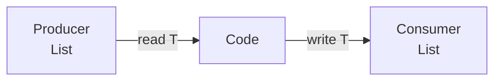

# PECS — Producer Extends, Consumer Super

The API design rule for wildcards (Bloch): choose variance from how the parameter is used.

## Mental Model

```text
Producer of T  →  ? extends T   (get T out)
Consumer of T  →  ? super T     (put T in)
Both           →  T             (invariant)
Don’t care     →  ?
```



## Simple Example

```java
public static <T> void copy(List<? extends T> src, List<? super T> dest) {
    for (T t : src) {
        dest.add(t);
    }
}
```

## Advanced Example (realistic service API)

```java
public interface Outbox {
    <E extends DomainEvent> void append(E event);

    /** Accept events from any list of subtypes. */
    default void appendAll(List<? extends DomainEvent> events) {
        for (DomainEvent e : events) append(e);
    }
}

public final class ProjectionWriter {
    /** Write projected DTOs into any list that can accept them. */
    public void writeRows(List<ProjectionRow> rows, List<? super ProjectionRow> sink) {
        sink.addAll(rows);
    }
}

public final class Sorts {
    public static <T> void byKey(List<T> items, Comparator<? super T> order) {
        items.sort(order);
    }
}
```

JDK exemplars: `Collections.copy`, `Stream.map`/`filter` signatures, `Comparable`/`Comparator` usage.

## Internal Behavior

PECS is purely a **compile-time** discipline. Runtime still erased. Wrong wildcard → compile error (good) or forced unchecked casts (bad API).

## Production Use Case

Any library method that takes collections/functions: loaders `Function<? super K, ? extends V>`, event handlers, DTO mappers, copy between layers.

## Common Mistake

```java
void process(List<PaymentEvent> events) { } // rejects List<PaymentCaptured>
// better if only reading:
void process(List<? extends PaymentEvent> events) { }
```

Or using wildcards when you both add and get as `T` — use `List<T>`.

## Interview Trap

Memorizing the slogan without applying it: interviewer asks you to sign `flatten(List<List<? extends T>>)` / `addAll` — derive from producer/consumer roles, don’t guess.

“Does PECS apply to return types?” — Prefer **precise returns**; wildcards on returns often poison callers (Effective Java guidance).

## Principal-Level Discussion

PECS is how you keep APIs **open to subtypes** without breaking type safety. Staff+ candidates should also discuss: invariance of generics, why `List<String>` isn’t `List<Object>`, and when to introduce a named type parameter vs only wildcards.

If call sites need casts, the signature is wrong — fix PECS before documenting “unchecked.”

### Related

[upper-bounds.md](./upper-bounds.md) · [lower-bounds.md](./lower-bounds.md) · [wildcards.md](./wildcards.md) · [interview.md](./interview.md)
