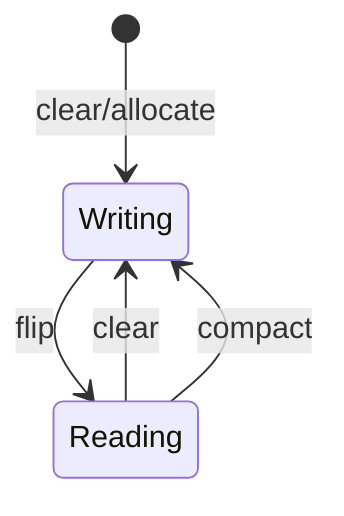

# Buffers (`ByteBuffer` and friends)

Container for channel I/O with `capacity`, `limit`, `position`, optional `mark`.

## Mental Model

```text
allocate / allocateDirect
put… → flip → get… → clear (or compact)
```



## Java 25 Examples

```java
ByteBuffer buf = ByteBuffer.allocateDirect(64 * 1024);
int n = channel.read(buf);
if (n < 0) { /* EOF */ }
buf.flip();
while (buf.hasRemaining()) {
    byte b = buf.get();
    // …
}
buf.compact(); // if partial message framing left unread
```

Endianness: `buf.order(ByteOrder.BIG_ENDIAN)` for network/file formats.

## Heap vs Direct

| | Heap `allocate` | Direct `allocateDirect` |
|--|-----------------|-------------------------|
| Memory | On-heap | Off-heap |
| GC | Visible | Harder to track; use judiciously |
| Channel | May copy | Often fewer copies |

## Production — batch framing

Length-prefixed records: read until enough bytes, compact remainder — classic buffer use.

## Failure Scenario

Calling `get` without `flip` after `read` → wrong data. Leaking many large direct buffers → native OOM.

### Related

[file-channels.md](./file-channels.md) · [nio.md](./nio.md)
