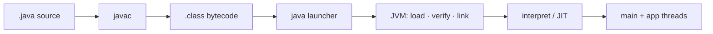

# Java Compilation, Bytecode & Execution Lifecycle

From `PaymentService.java` to a running JVM process on **JDK 25**.

## 1. Mental Model



## 2. Simple Explanation

`javac` compiles source to **portable bytecode**, not native machine code. `java` starts a JVM that loads classes and executes them (interpreter, then JIT for hot code).

## 3. Technical Explanation

| Stage | What happens |
|-------|----------------|
| Compile | Parse/check → `.class` (constant pool, methods, attributes) |
| Launch | JVM process, module/classpath setup |
| Load | Bytes → Class; linking/init as needed |
| Execute | Bytecodes; hot methods become native nmethods |
| End | Non-daemon work done → JVM exit |

`--release 25` locks language + API to that platform.

## 4. Internal Behavior

**Bytecode:** stack-machine instructions (`aload`, `invokevirtual`, `getfield`, …). Inspect with `javap -c`.

**Lifecycle:** first active use may trigger class initialization (`<clinit>`). Tiered compilation: interpret → C1 → C2 as heat grows; deoptimize if assumptions fail.

**Versioning:** class major version must be ≤ runtime capability or you get `UnsupportedClassVersionError`.

## 5. Java 25 Example

```java
public final class PricingBootstrap {
    public static void main(String[] args) {
        IO.println("runtime=" + Runtime.version());
    }
}
```

```bash
javac --release 25 PricingBootstrap.java
javap -c -p PricingBootstrap
java PricingBootstrap
java PricingBootstrap.java    # source-run path
```

## 6. Real-World Scenario

**Order service CI:** all modules build with Temurin 25 and `--release 25`. A laptop on early-access bits with preview flags once shipped bytecode prod couldn’t load — CI now fails on version drift.

## 7. Common Mistake

Believing “Java is only interpreted” or “javac emits machine code like gcc.” Also: compiling on 25 without `--release` while claiming “runs on 17.”

## 8. Failure Scenario

Symptom: works locally, `UnsupportedClassVersionError` in prod. Investigate `java -version` vs class major; rebuild with correct `--release` or upgrade runtime.

## 9. Performance Implications

Cold start pays interpreter tax; hot paths JIT. First-request latency ≠ steady-state. Compilation settings don’t replace algorithmic cost.

## 10. Interview Questions

- What does `javac` produce?  
- What happens after `java com.example.Main`?

## 11. Senior-Level Follow-ups

- How do you keep compile target and prod JVM aligned across many services?  
- When do preview language features enter the compile flags?

## 12. Principal Engineer Perspective

Treat **toolchain + `--release` + runtime image** as one compatibility contract. Prefer boring reproducible builds; allow `java File.java` for exploration, not production packaging.

### Related

[jdk-jre-jvm.md](./jdk-jre-jvm.md) · [javac-java-jshell.md](./javac-java-jshell.md) · [classpath.md](./classpath.md) · [../jvm-internals](../jvm-internals/)
