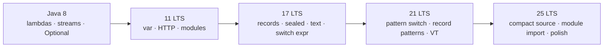

# Modern Java — Evolution to Java 25 LTS

How the language and APIs moved from **Java 8** to **Java 25**: less boilerplate, stronger data modeling, pattern-based control flow, and clearer APIs.

**Standards:** [DEEP_LEARNING_STANDARD.md](../DEEP_LEARNING_STANDARD.md) · [MASTER_INSTRUCTION.md](../MASTER_INSTRUCTION.md)

## Evolution map

| Era | LTS | What changed for day-to-day coding |
|-----|-----|-------------------------------------|
| 8 | 8 | Lambdas, functional interfaces, Stream, Optional, `java.time` |
| 9–11 | 11 | Modules, `var`, HTTP Client, collection factories |
| 12–17 | 17 | Switch expressions, text blocks, records, sealed, `instanceof` patterns |
| 18–21 | 21 | Pattern `switch`, record patterns, sequenced collections, virtual threads* |
| 22–25 | **25** | Unnamed `_`, compact source / instance main, module import; preview: primitive patterns |

\*Virtual threads: see concurrency / virtual-threads folders — mentioned here for era context only.

## Study path

1. Timeline: [java-evolution.md](./java-evolution.md)  
2. Java 8 core: [lambdas](./lambdas.md) → [functional-interfaces](./functional-interfaces.md) → [optional](./optional.md)  
3. Ergonomics: [var](./var.md) → [text-blocks](./text-blocks.md) → [switch-expressions](./switch-expressions.md)  
4. Data-oriented: [records](./records.md) → [sealed-classes](./sealed-classes.md)  
5. Patterns: [pattern-matching](./pattern-matching.md) → instanceof / switch / [record-patterns](./record-patterns.md) → [unnamed](./unnamed-variables-patterns.md) → [primitive-patterns](./primitive-patterns.md) (preview)  
6. Platform & APIs: [module-system](./module-system.md) → [modern-apis](./modern-apis.md) → [modern-collection-apis](./modern-collection-apis.md)  
7. Style: [modern-coding-style](./modern-coding-style.md) · Drill: [interview.md](./interview.md)

## Migration stance (Principal)

| Move aggressively | Move carefully | Avoid in prod without policy |
|-------------------|----------------|------------------------------|
| Records for DTOs/values | Full JPMS for large monoliths | Preview features (`--enable-preview`) |
| Sealed + pattern switch for domain events | Rewriting every `Optional` chain | Clever pattern golf that hurts readability |
| Text blocks for SQL/JSON | `var` everywhere in public APIs | Treating `Optional` as a field type casually |
| Collection factories / sequenced APIs | Big-bang Stream rewrites | |

### Related

[../oop](../oop/) · [../java-fundamentals](../java-fundamentals/)
