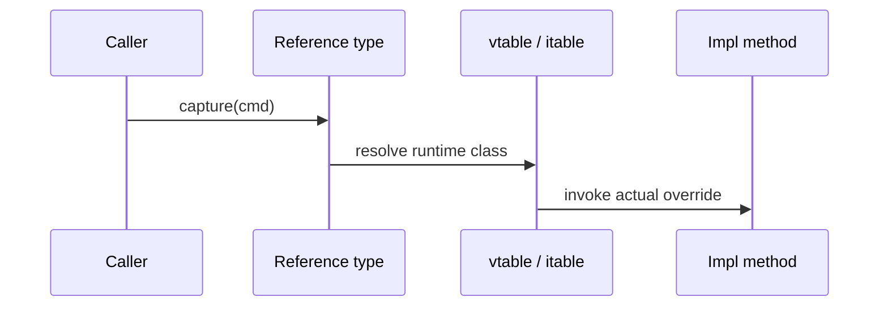

# Polymorphism & Dynamic Dispatch

**Polymorphism** = one call site, many behaviors. In Java: overloading (compile-time) and overriding + **dynamic dispatch** (runtime).

## 1. Mental Model

```text
PaymentPort port = lookup(adapter);  // static type: interface
port.capture(cmd);                   // runtime: Stripe or Wallet impl
```



## 2. Problem It Solves

Write orchestration once (`checkout`) while PSPs, notifiers, and pricing policies vary.

## 3. Bad Design → Problems → Better Design

**Bad:** `if (type == STRIPE) … else if (type == WALLET) …` everywhere.

**Problems:** OCP violation; missed branches; scattershot changes.

**Better:** Polymorphic `PaymentPort` implementations selected once (factory/DI).

```java
public final class CheckoutService {
    private final PaymentPort payments;
    public OrderId checkout(Quote quote) {
        return payments.capture(CaptureCommand.from(quote)).orderId();
    }
}
```

## 4. Technical Rules (Java 25)

| Kind | Mechanism | Bound when |
|------|-----------|------------|
| Static polymorphism | Overloading | Compile time |
| Dynamic polymorphism | Overriding | Runtime (virtual) |
| `static` / `private` / `final` | Not dynamically overridden | — |
| Sealed + switch | Exhaustive alternative to open polymorphism | Compile time |

## 5. Internal Behavior

`invokevirtual` / `invokeinterface` use receiver class. JIT inlines monomorphic/bimorphic sites; megamorphic sites stay slower. Overload resolution never looks at runtime arg types beyond what’s known statically (no multiple dispatch).

## 6. Domain Scenarios

- **Inventory:** `ReservationPolicy` implementations per warehouse type.  
- **Notifications:** `Notifier.send` dispatches to email/push adapters.

## 7. Trade-offs & When Not

Open polymorphism is great for unknown future adapters. Closed domains (payment events) often clearer as **sealed + switch** (expression problem trade-off).

## 8. Failure Scenario

Expected `WalletPort.capture` but factory returned stub in prod config → silent no-op charges. Fix: startup checks; metric on adapter class name; contract tests.

## 9. LLD Interview Scenario

Add Apple Pay without editing `CheckoutService`. Show polymorphic design. Then ask: how do you handle a method only one adapter supports?

## 10. SOLID / Extensibility

Polymorphism is OCP’s main lever. Combine with ISP so callers don’t depend on unused methods.

## 11. Interview Ladder

- Compile-time vs runtime polymorphism?  
- What is dynamic dispatch?  
- Why can’t you override static methods?

## 12. Principal Engineer Perspective

Choose **open polymorphism** (interfaces) for plugins/adapters; **closed ADTs** (sealed) for domain facts. Avoid `instanceof` forests unless migrating toward sealed models.

### Related

[method-overriding.md](./method-overriding.md) · [method-overloading.md](./method-overloading.md) · [sealed-classes.md](./sealed-classes.md) · [interfaces.md](./interfaces.md)
