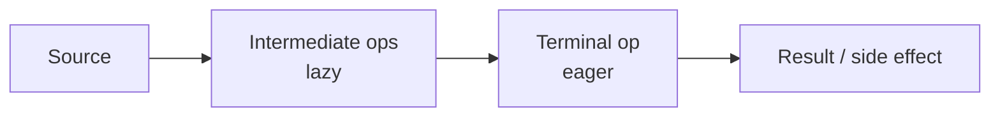

# Stream API — Engineering Guide (Java 25)

Lazy, functional pipelines over data — for transforms, reporting, and analytics. Not a replacement for every loop or for blocking I/O fan-out.

**Standards:** [DEEP_LEARNING_STANDARD.md](../DEEP_LEARNING_STANDARD.md) · [MASTER_INSTRUCTION.md](../MASTER_INSTRUCTION.md)

## Pipeline anatomy

```text
source ──► intermediate* (lazy) ──► terminal (eager trigger)
  List      map/filter/flatMap         collect/reduce/forEach
  files     sorted/distinct/limit      findFirst/anyMatch
```



## Study path

1. Lifecycle: [stream-lifecycle](./stream-lifecycle.md) → [stream-creation](./stream-creation.md) → [lazy-evaluation](./lazy-evaluation.md) → [intermediate-operations](./intermediate-operations.md) → [terminal-operations](./terminal-operations.md)  
2. Core ops: [map](./map.md) · [filter](./filter.md) · [flatmap](./flatmap.md) · [reduce](./reduce.md) · [collect](./collect.md)  
3. Collectors: [grouping-by](./grouping-by.md) · [partitioning-by](./partitioning-by.md) · [joining](./joining.md) · [tomap](./tomap.md) · [tolist](./tolist.md)  
4. Specialty: [optional-and-streams](./optional-and-streams.md) · [primitive-streams](./primitive-streams.md) · [parallel-streams](./parallel-streams.md)  
5. Engineering: [stream-vs-loop](./stream-vs-loop.md) · [side-effects](./side-effects.md) · [stateful-operations](./stateful-operations.md) · [stream-performance](./stream-performance.md)  
6. Drill: [interview.md](./interview.md)

## Scenario index

| Domain | Typical pipeline |
|--------|------------------|
| Orders | filter status → group by customer → sum cents |
| Customers | map to DTO → toMap by id |
| Transactions | flatMap line items → partitioningBy risk |
| Logs | filter level → groupingBy service → counting |
| Analytics | primitive streams → summarizing |
| Reporting | joining CSV / groupingBy + mapping |

## Principal stance

Default **sequential**, **pure** intermediates, **collect** at the end. Parallel only when measured. Prefer loops for complex control flow and I/O-heavy work.
